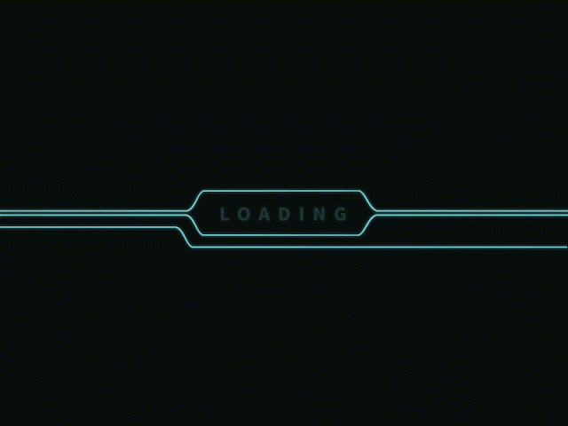

<h2>Hey there! I'm Erick</h2>

  <!-- GitHub Stats -->
  

  <!-- GIF on the right side -->
  

 
  <!-- Fiverr Badge -->
  

  <!-- Upwork Badge -->
  

  <!-- LinkedIn Badge -->
  
  
  <!-- Wellfound Badge -->
  

  <!-- Instagram Badge -->
  
  

<!--
**koineone/koineone** is a ✨ _special_ ✨ repository because its `README.md` (this file) appears on your GitHub profile.

Here are some ideas to get you started:

- 🔭 I’m currently working on ...
- 🌱 I’m currently learning ...
- 👯 I’m looking to collaborate on ...
- 🤔 I’m looking for help with ...
- 💬 Ask me about ...
- 📫 How to reach me: ...
- 😄 Pronouns: ...
- ⚡ Fun fact: ...
-->
